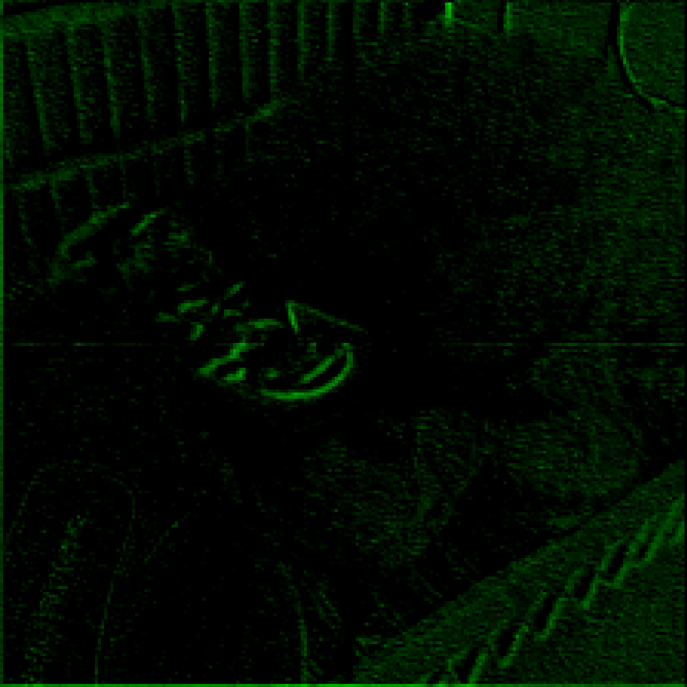
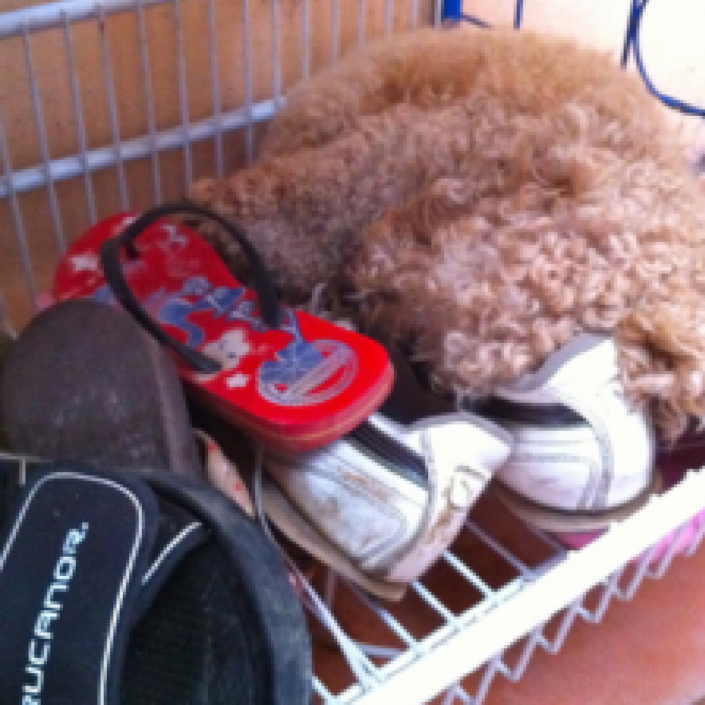
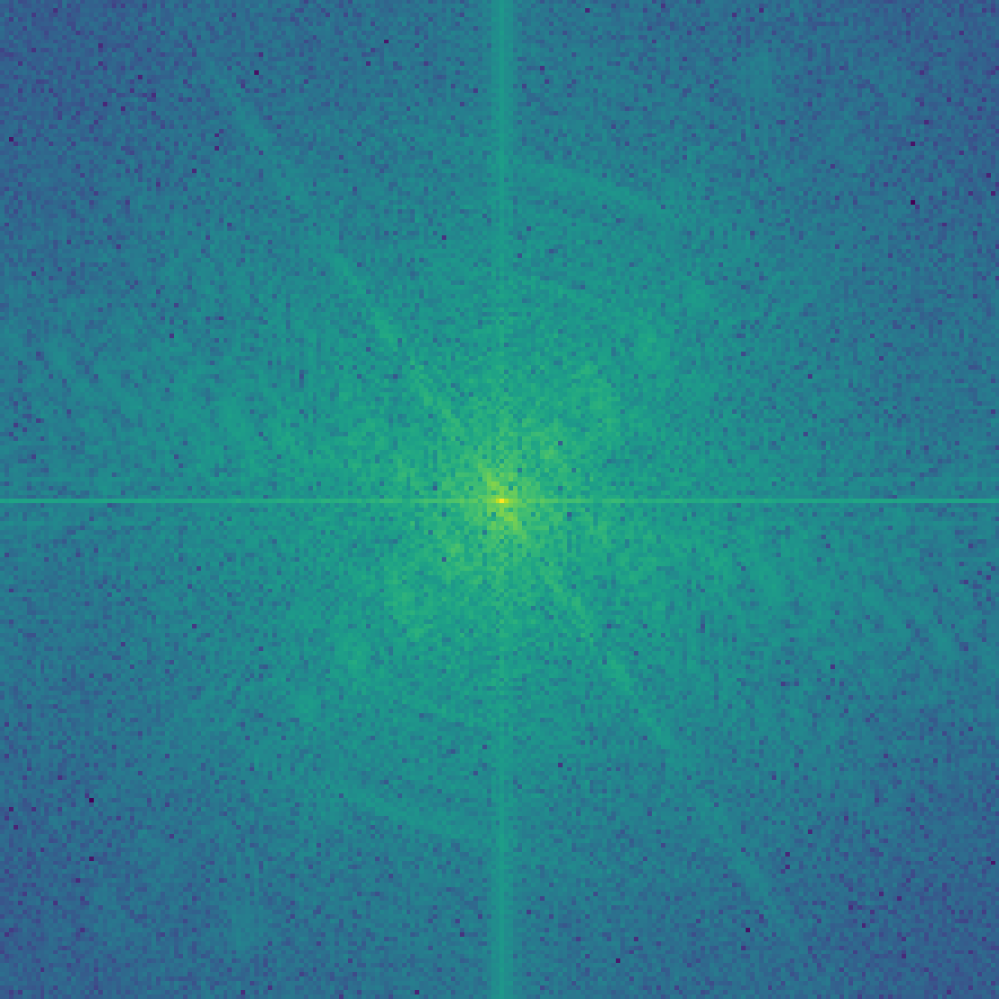
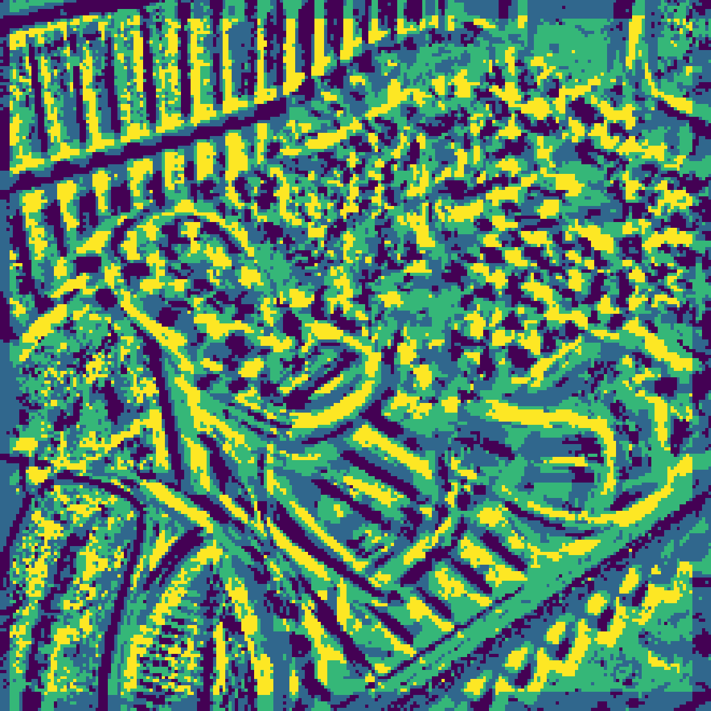

# Binary Deepfake Detection




Implementation and experiments for binary deepfake detection.

## Quick Start

```bash
python -m venv .venv
# Windows PowerShell
.venv\Scripts\Activate.ps1
pip install -r requirements.txt
python train.py --cfg ./configs/ablation_baseline.cfg
```

## Qualitative Results

The project supports different input representations for improved forensic cues:

| RGB | FFT | LBP | Adapted Features |
| --- | --- | --- | --- |
|  |  |  |  |

## Project Structure

```text
.
|-- configs/                 # Training/testing configs
|-- images/                  # Visual examples used in project material
|-- lib/                     # Utility and preprocessing helpers
|-- pretrained/              # Place BNext pretrained checkpoints here
|-- train.py                 # Model training entry point
|-- test.py                  # Model evaluation entry point
|-- model.py                 # Core model implementation
`-- requirements.txt
```

## Setup

1. Create and activate a Python environment (recommended: Python 3.10+):

```bash
python -m venv .venv
# Windows PowerShell
.venv\Scripts\Activate.ps1
```

2. Install dependencies:

```bash
pip install -r requirements.txt
```

3. Ensure `BNext` code is available at `./BNext`.

4. Download BNext pretrained models and place them in `pretrained/`.

5. Prepare datasets and update paths in your config file (`configs/*.cfg`):

- `cifake_path`
- `coco2014_path`
- `coco_fake_path`
- `dffd_path`

## Training

Use any config file under `configs/`:

```bash
python train.py --cfg ./configs/ablation_baseline.cfg
```

Training logs are sent to Weights & Biases (W&B). Log in first if needed:

```bash
wandb login
```

## Testing

Run evaluation with the same config pattern:

```bash
python test.py --cfg ./configs/ablation_baseline.cfg
```

Make sure checkpoint files exist in the configured `test.weights_path` directory.

## Artifacts

- `poster.pdf`
- `presentation.pdf`
- `images.ipynb`

